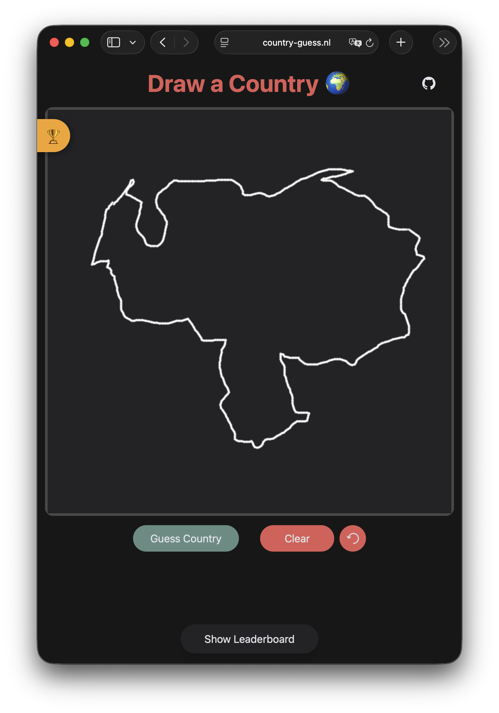
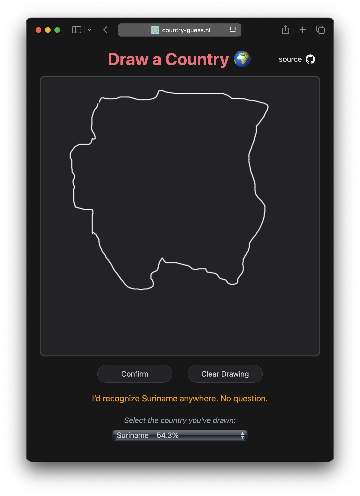
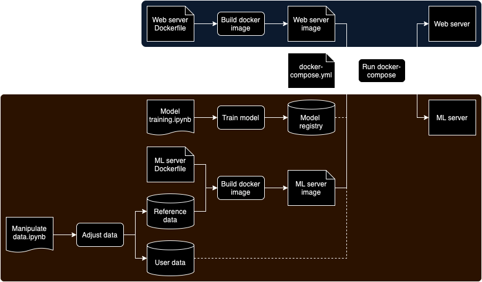

# Country Guess App

Welcome to my Country Guess App side project! With this machine learning application you can test your drawing skills. You can draw a country shape in the browser, a Convolutional Neural Network will then guess which country you have drawn.

## Table of Contents

- [Screenshots](#screenshots)
- [Getting Started](#getting-started)
  - [Local Installation](#local-installation)
  - [Docker Installation](#docker-installation)
- [Usage](#usage)
  - [Drawing](#drawing)
  - [Diving in](#diving-in)
- [Architecture and Design](#architecture-and-design)
- [License](#license)

## Screenshots

<div style="display: flex; justify-content: space-around;">
  
  
</div>

## Getting Started

### Local

1. Navigate to the project directory.
2. Install the required packages:
```
pip install -r mlserver/requirements.txt
pip install -r webapp/requirements.txt
```
3. Set the model name
```export MODEL_NAME=triplet_model```
4. Run the ML server:
```python mlserver/serve.py```
5. Set the ML server URL:
```export MLSERVER_URL=http://127.0.0.1:5001/predict```
6. Start the web app:
```python webapp/app.py```
7. Access the app at [http://localhost:5000](http://localhost:5000)

### Docker
1. Navigate to the project directory.
2. Run the app using Docker Compose:
```docker-compose up -d```
3. Access app at [http://localhost:5000](http://localhost:5000)

## Usage

### Drawing

Once the app is running, you can draw a country shape in the browser. The ML model will guess the country, and you can confirm or correct the guess using a dropdown list. The drawing will be included in the test set for model evaluation. 

### Diving in

The repository includes two Jupyter notebooks: the [Manipulate data](<Manipulate data.ipynb>) notebook and the [Model training](<Model training.ipynb>) notebook. The Manipulate Data notebook allows you to modify the reference country shapes. These shapes are used by the model as a reference. In the notebook you can see how the original [dataset](https://public.opendatasoft.com/explore/dataset/country_shapes/information/?location=2,-32.99024,1.40625&basemap=jawg.light) has been processed. Additionally, this notebook let you examine and remove user-submitted country drawings. These user drawings makeup the test set for model training.

The Model Training notebook is used to train a machine learning model. At the moment a basic Convolutional Neural Network is used with a triplet training objective. The training data is generated by augmenting the reference country shapes to resemble user drawings. The reference country shape is simplified, smoothed, and subjected to a series of geometric augmentations. Small polygons are also randomly removed to simulate the user forgetting to draw small islands. The intensity of the augmentation can be controlled with the temperature parameter. 

Example of generated drawing:


When training a model, you can start an MLflow Tracking server by running the ```mlflow ui``` command. Here you can compare different runs and register a model through the UI. The model name can be set in the docker-compose.yml or by changing the environment variable when running the app locally. The ML server will select the model with the “champion” alias.

## Architecture and Design

The architecture and design of the app can be visualized with the following diagram:



The application consists of two main services as described in the docker-compose.yml file: the ML server and the web app. The ML server image is built using a copy of the reference data. The mlruns directory is mounted as a volume to the ML server container, this way the ML server can use models added later. Users can change the model name in the docker-compose.yml file, and the ML server will select the model with the “champion” alias. If the mlruns volume is not mounted, the ML server will fall back on a default model within the image. 

The web app is based on Flask. After the user has drawn a country shape, the web app sends it to the ML server. The ML server resonse with a ranking of all the countries within the reference country set. Users can confirm this guess or select the correct country from a dropdown list. To preserve user drawings, the user data is mounted as a volume. If no user data is mounted, the drawings made will not persist outside the Docker container.

## License

This project is licensed under the MIT License. See the [LICENSE](LICENSE) file for details.
