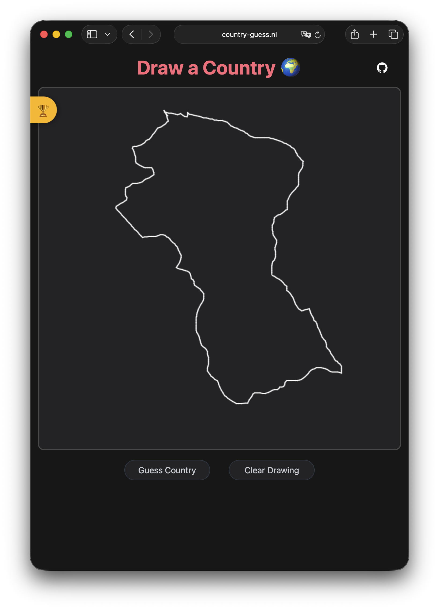
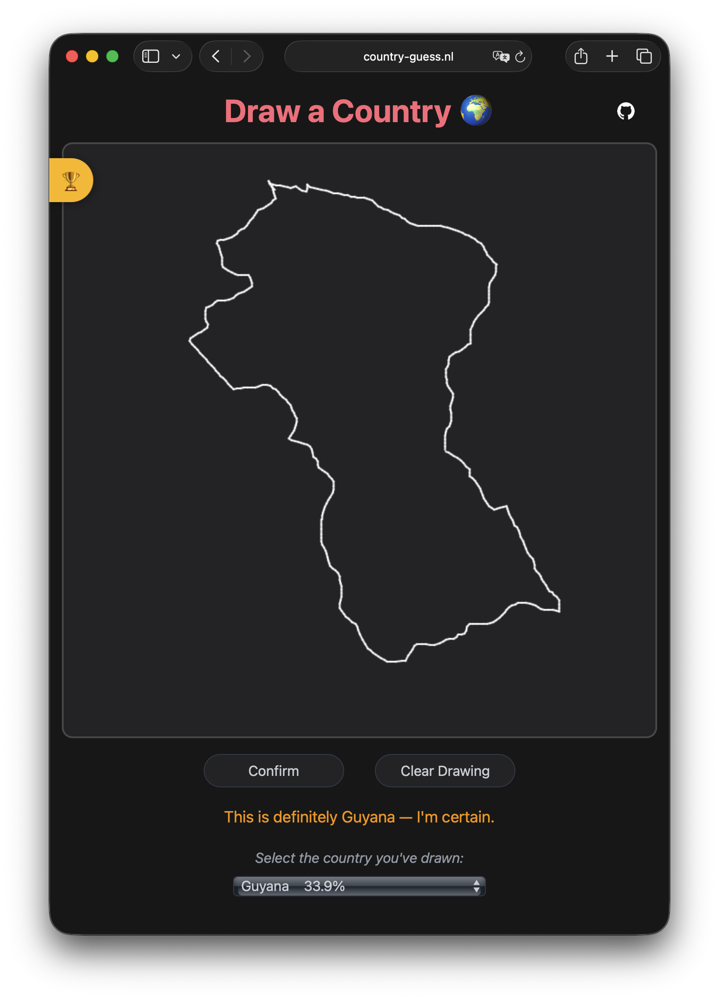

#  Country Guess App

[](https://country-guess.nl) [](https://github.com/jortdejong13/country-guess/actions/workflows/build.yml) [](https://github.com/jortdejong13/country-guess/actions/workflows/test.yml) 

Welcome to my Country Guess App side project! With this machine learning application you can test your drawing skills. You can draw a country shape in the browser, a Convolutional Neural Network will then guess which country you have drawn.

## Table of Contents

- [Screenshots](#screenshots)
- [Getting Started](#getting-started)
  - [Using Pre-built Docker Images](#1-using-pre-built-docker-images-recommended)
  - [Building Docker Images Locally](#2-building-docker-images-locally)
  - [Local Python Installation](#3-local-python-installation)
- [Usage](#usage)
  - [Drawing](#drawing)
  - [Diving in](#diving-in)
- [Architecture and Design](#architecture-and-design)
- [License](#license)

## Screenshots

<div style="display: flex; justify-content: space-around;">
  
  
</div>

## Getting Started

The Country Guess App is accessible at [country-guess.nl](https://country-guess.nl), feel free to try it out!
<br>Alternatively, you can follow the instructions to run the app locally:

### 1. Using Pre-built Docker Images (Recommended)
Pull and run the latest images:
```bash
docker compose pull
docker compose up -d
```

### 2. Building Docker Images Locally
Build and run the containers:
```bash
docker compose up -d --build
```

### 3. Local Python Installation
1. Install the required packages:
```bash
pip install -r mlserver/requirements.txt
pip install -r webapp/requirements.txt
```
2. Set the model name and run the ML server:
```bash
MODEL_NAME=triplet_model python -m mlserver.serve
```
3. Set the ML server URL and start the web app:
```bash
MLSERVER_URL=http://127.0.0.1:5001/predict python -m webapp.app
```

<br>After setting up, you can access the app at [http://localhost:5000](http://localhost:5000)

## Usage

### Drawing

Once the app is running, you can draw a country. The ML model will guess which country has been drawn, you can confirm or correct the guess using the dropdown list. This drawing will then be included in the test set for future model evaluation.

### Diving in

The repository includes two Jupyter notebooks: the [Manipulate data](<Manipulate data.ipynb>) notebook and the [Model training](<Model training.ipynb>) notebook. The Manipulate Data notebook allows you to modify the reference country shapes. These shapes are used by the model as a reference. In the notebook you can see how the original [dataset](https://public.opendatasoft.com/explore/dataset/country_shapes/information/?location=2,-32.99024,1.40625&basemap=jawg.light) has been adjusted. Additionally, this notebook lets you examine and remove user-submitted country drawings. These user drawings makeup the test set for model training.

The Model Training notebook is used to train a machine learning model. At the moment a basic Convolutional Neural Network is used with a triplet training objective. The model embeds the drawings and reference countries into a vectorspace, it can then rank the reference countries based on their distance to the drawing. The training data is generated by augmenting the reference country shapes to resemble user drawings. The reference country shape is simplified, smoothed, and subjected to a series of geometric augmentations. Small polygons are also randomly removed to simulate a user missing small islands. The intensity of the augmentations can be controlled with a single temperature parameter.

*Example of generated drawing:*


When training a model, you can start an MLflow Tracking server by running the ```mlflow ui``` command. Here you can compare different runs and register a model through the UI. The ML server will select the model with the “champion” alias. The model name can be set in the docker-compose.yml or by changing the environment variable when running the app locally.

## Architecture and Design

The following diagram depicts the different components that make up the app:


The application consists of two independent services: the ML server and the web app backend.<br>
The ML server image is built using a copy of the reference data. The mlruns directory is mounted as a volume to the ML server container, this way the ML server can use models added later. Users can change the model name in the docker-compose.yml file, and the ML server will select the model with the “champion” alias. If the mlruns directory is not mounted, the ML server will fall back on a default model within the image.

The web app is based on Flask. After the user has drawn a country shape, the web app sends it to the ML server. The ML server responses with a ranking of all the countries in the reference country dataset. The user can confirm this guess or select the correct country from a dropdown list. The drawing will be saved along with the country name. To preserve user drawings, the user data is mounted as a volume. If no user data is mounted, the drawings made will not persist outside the Docker container.

## License

This project is licensed under the MIT License. See the [LICENSE](LICENSE) file for details.
